# Source-Level Java CFG Generator

Parses Java with ANTLR and emits a **control-flow graph per method** — as a
Graphviz figure, as JSON, or as Graphviz source.

Each basic block holds the source statements that run straight through, annotated
with their line and column. Each edge is labelled with the condition that takes
you along it. The graph is *source-level*: blocks contain Java statements, not
bytecode.

```java
public class Example1 {
    public static void main(String[] args) {
        for (int i = 1; i <= 5; i++) {
            System.out.println(i);
        }
    }
}
```


### Reading a figure

| | |
| --- | --- |
| green oval | `start` |
| red oval | `end` |
| white box | a straight-line block; each row is a statement with its `line:column` |
| blue box | a condition, with `true` and `false` edges |
| green box | a `switch` dispatch, one labelled edge per case |
| orange box | a `catch` clause |
| purple box | a `finally` block |
| dashed orange edge | an exception edge, labelled with the caught type |
| dotted grey edge | an `abrupt` edge — see [exception modeling](#supported-constructs) |
| yellow tab | package, class, and signature of the method |

## What was wrong before

The generator ran, and produced graphs that were roughly 70% correct — which is
the worst failure mode available, because nothing signalled the other 30%. Two
architectural choices caused it, and both failed silently.

**The AST was built by a listener that guessed where statements belonged.** A
stack held the enclosing construct and every hook re-derived "which body list do
I append to?" by type-switching on its top, with a string flag toggled to track
whether an `if` was in its then- or else-branch — read with two different
conventions in different hooks. All of it wrapped in `try: ... except: pass`. So:

- `continue` inside an `if` was **dropped entirely** — the hook picked the target
  list and never appended to it.
- An un-braced `if (x) return y;` entered no block, so the toggle never fired and
  the `return` was filed into the **else** branch.
- `else if` appended without pushing, but the exit hook popped anyway, corrupting
  the stack for the rest of the method.
- The grammar's five dangling-else variants had no hooks at all.
- `try`/`catch`/`finally`, `throw`, labels, and arrow `switch` were unhandled.

**The CFG was assembled by repairing a graph afterwards, using node-index
arithmetic.** `initIndex + 1` to guess which block held a loop condition;
`counter - 1` scanning downward to reattach orphaned blocks; out-degree
heuristics to decide where a `false` edge should go. And `break`/`continue` were
appended to blocks as *statements*, so they produced no edges — a loop containing
a `break` had no path to its exit.

The damage was not subtle. Running the old code against `Example10.java` and
`Example11.java`:

| Sample | conditionals in the old graph | in the new graph |
| --- | --- | --- |
| `Example10` | `whileCounter <= …`, `i <= …`, `doWhileCounter % 3 == 0`, `doWhileCounter <= …` | the same, **plus `doWhileCounter % 5 == 0`** |
| `Example11` | `a < i * 3`, `k <= 5` | the same, **plus `i < 5`** |

`Example10`'s `else if` branch was missing from the graph, along with
`doWhileCounter++`. In `Example11` the inner `if` condition was gone, so the
graph showed the then-branch and the `for` loop running *in sequence* rather than
as exclusive alternatives.

Both layers were rewritten: AST construction is now a visitor that returns nodes,
and CFG construction links blocks as it goes. `slcfg/verify.py` plus the golden
tests exist so that a regression of this kind fails loudly instead of quietly
degrading. See [Architecture](#architecture) and [Testing](#testing).

## Background

This started from reading about the Go compiler, and these two talks:

- [GopherCon 2022: Jesús Espino — Hello World, from the Code to the Screen](https://www.youtube.com/watch?v=rfbMj7F1vUQ)
- [GopherCon 2017: Keith Randall — Generating Better Machine Code with SSA](https://youtu.be/uTMvKVma5ms?si=gi7I0bB_QhGw1sZV)

After reading the [go/ast](https://pkg.go.dev/go/ast) package docs and playing
with [this AST viewer](https://yuroyoro.github.io/goast-viewer/index.html), the
idea was to build something similar for Java. The first attempt was in Go with
[this repo](https://github.com/uint48/antlr-golang), but Python with ANTLR turned
out to be much more direct.

## Use cases

- See what a piece of code looks like at the level a compiler works with.
- Hand-generate assembly or bytecode from the control-flow graph as an exercise.
- Learn how parsers, lexers, parse trees, and ASTs fit together.
- Learn ANTLR on a real grammar.
- Work through regular and context-free grammars using the Java grammar.

## Install

**1. Python 3.12+ and the Python packages.**

```shell
python3 -m venv .venv
source .venv/bin/activate
pip install -r requirements.txt
```

> If `python3 -m venv` fails with *"ensurepip is not available"* on
> Debian/Ubuntu, either `sudo apt install python3-venv`, or use
> [uv](https://github.com/astral-sh/uv): `uv venv .venv && uv pip install -r requirements.txt`.

**2. The Graphviz system binary**, for `pdf`/`png`/`jpg`/`svg` figures. The
Python `graphviz` package only shells out to `dot`; it does not bundle it.

```shell
sudo apt install graphviz     # Debian/Ubuntu
brew install graphviz         # macOS
```

Check it: `dot -V`.

## Usage

```shell
# One file: JSON + a PDF figure per method, under output/Example1/
python main.py javasamples/Example1.java

# A whole tree, as PNG, mirroring the source layout under output/
python main.py javasamples/ --out output --format png

# Verify every method against the structural invariants; non-zero exit on failure
python main.py javasamples/ --check
```

| Option | Meaning |
| --- | --- |
| `path` | a `.java` file, or a directory walked recursively |
| `--out DIR` | output root (default `output`); one subdirectory per source file |
| `--format {pdf,png,jpg,svg,dot}` | figure format. `dot` writes Graphviz source and is the only one that does not need the `dot` binary |
| `--no-json` | skip the JSON |
| `--no-render` | skip the figure |
| `--check` | verify invariants, write nothing, exit non-zero on any violation |
| `--strict` | fail on an unmodeled construct instead of warning |
| `--jobs N` | process N files in parallel |
| `--quiet` | only report problems |
| `--traceback` | print a traceback when a file fails |

A file that fails to parse is reported and skipped; the rest of a directory run
still completes.

To regenerate every figure in `docs/`:

```shell
python tools/render_docs.py --clean              # jpg + pdf, as this README uses
python tools/render_docs.py --format svg png
```

## Architecture

```
 .java ──▶ ANTLR lexer + parser ──▶ parse tree ──▶ visitor ──▶ AST ──▶ builder ──▶ CFG ──▶ figure / JSON
           grammars/*.g4, gen/       slcfg/parse    astbuilder   ast     cfg               render
```

| File | Role |
| --- | --- |
| `grammars/Java20Lexer.g4`, `Java20Parser.g4` | the Java 20 grammar |
| `gen/` | ANTLR-generated lexer, parser, listener, visitor — do not edit by hand |
| `slcfg/parse.py` | file → parse tree; turns the first syntax error into an exception |
| `slcfg/ast.py` | AST node types, and `iter_simple_statements` for traversal |
| `slcfg/expressions.py` | parse-tree → expression AST |
| `slcfg/astbuilder.py` | parse-tree → statement AST, as a visitor |
| `slcfg/cfg.py` | AST → CFG, one recursive pass |
| `slcfg/verify.py` | structural invariants |
| `slcfg/render.py` | Graphviz and JSON output |
| `slcfg/errors.py` | diagnostics: warn, or raise under `--strict` |
| `main.py` | CLI |
| `tools/render_docs.py` | regenerate the figures under `docs/` |

Two details do most of the work.

**AST construction is a visitor, not a listener.** A visitor *returns* nodes, so
the caller decides where a subtree belongs: `visitBlock` returns a `BlockStmt`
and its parent places it. A listener has to answer "which body list does this
statement belong to?" from mutable state, and that question is where the previous
implementation went wrong.

**CFG construction links blocks as it goes.** Two stacks carry the targets that
control transfers need:

- `_loops` — where `break` and `continue` go. They become **edges**, not
  statements. Labels resolve against this stack too, so `continue outer` reaches
  the right loop.
- `_handlers` — the enclosing `try` regions, so `throw` and `return` reach the
  right `catch` or `finally`.

`_current` is the block statements are appended to, or `None` when flow is
*sealed* — the last statement was a terminator, so what follows is unreachable
and no fallthrough edge is created.

Afterwards: drop blocks unreachable from the entry, splice out empty blocks
(only where no edge label would be lost), merge straight-line chains, and
renumber breadth-first so ids read top to bottom.

## Supported constructs

| Construct | How it is modeled |
| --- | --- |
| `if` / `else` / `else if` | condition block with `true`/`false` edges; a join block only if an arm falls through. `else if` is just an `if` inside the else block |
| `while` | condition header; back edge from the body; `false` → exit |
| `do`-`while` | body first, condition after; `true` → body |
| `for` | init in the preceding block; condition header; separate update block, so `continue` runs the update before re-testing |
| `for (;;)` | header condition `true`; the structural `false` edge is kept |
| `for`-each | `has next(iterable)` header, body opens with `v = next(iterable)` — see below |
| `switch`, colon form | one labelled edge per case group, keeping **every** label of `case 2, 3:`; fall-through edges from the *end* of a group; `no match` edge when there is no `default` |
| `switch`, arrow form | same, minus fall-through |
| `break` / `continue`, labelled or not | **edges** to the resolved target |
| `label:` | on a loop, joins that loop's frame so `continue L` works; otherwise provides a `break L` exit |
| `return` | statement, then an edge to `end` — or to the enclosing `finally` first |
| `throw` | statement, then edges to the enclosing `catch` clauses, else `finally`, else `end` |
| `try` / `catch` / multi-catch / `finally` | block-level exception edges — see below |
| try-with-resources | resources acquired in the preceding block, then as `try` |
| `assert` | a branch: `true` continues, `false` leaves the method (AssertionError) |
| `synchronized` | body inlined between explicit `monitor enter` / `monitor exit` statements; taking a lock does not branch |
| lambda, anonymous class, local/nested/inner class | its own CFG as a separate method; the enclosing block shows only the expression that creates it |
| constructors, `static {}`, `{}` initializers | CFGs named after the class, `<clinit>`, and `<init>` |
| interface `default` / `static` methods | ordinary CFGs. Abstract methods have no body and produce none |

Two modeling choices worth knowing before you read a graph:

**`for`-each uses an iterator.** The header tests `has next(items)` and the body
opens with `T v = next(items)`. There is no type resolution here, so an array and
an `Iterable` are indistinguishable — and the iterator form is correct for both,
whereas an index rewrite with `.length` is wrong for every collection.

**Exceptions get block-level edges.** One dashed edge runs from the protected
region to each `catch` clause, rather than one from every statement that might
throw. A `finally` is reached from the normal path and from every handler. When a
`return` or `throw` inside the region routes through a `finally`, that block gets
one extra dotted `abrupt` edge out — an over-approximation, since we do not
duplicate the `finally` body per exit path the way `javac` does. It adds a path
that cannot actually be taken; it never omits one that can.

## JSON output

One file per method: `<Class>.<method>.json` (overloads get a suffix).

```json
{
  "package": "example",
  "class": "Example14",
  "method": "classify",
  "signature": "String classify(int value)",
  "source": "javasamples/Example14.java",
  "entry": 0,
  "exit": 9,
  "nodes": [
    { "id": 0, "type": "start", "statements": [] },
    { "id": 2, "type": "switch", "statements": [
        { "type": "expr_stmt", "position": "10:8", "expr": "switch (value)" }
    ] }
  ],
  "edges": [
    { "from": 2, "to": 5, "label": "case 2, 3" },
    { "from": 3, "to": 8, "label": "" }
  ],
  "unreachable": []
}
```

- `type` on a node is one of `start`, `end`, `regular`, `conditional`, `switch`,
  `catch`, `finally`.
- `label` on an edge is always present. `""` means unconditional; otherwise
  `true`, `false`, `case ...`, `default`, `no match`, `exception: T`, or `abrupt`.
- `unreachable` lists statements the builder proved could not execute (code after
  a `return`, say). They are omitted from the graph but recorded here rather than
  silently dropped.
- Block ids are breadth-first from the entry, and `entry`/`exit` name the two
  terminal blocks.

## Testing

```shell
pytest tests/ -q               # 111 tests
python main.py javasamples/ --check
```

Three layers:

**Structural invariants** (`slcfg/verify.py`), checked on every method of every
sample. These exist because the failure mode being fixed was *silent* — the old
generator produced graphs that looked plausible and were wrong, with no signal
short of reading every figure by hand.

- every block is reachable from `start`, and reaches `end` (a deliberate infinite
  loop is allowed, but only for blocks genuinely on a cycle)
- a conditional has exactly two out-edges, labelled `true` and `false`
- every out-edge of a switch dispatch is labelled, and the labels are distinct
- no empty block other than `start`, `end`, and ones the contraction pass
  deliberately kept — an empty `while (c) {}` body, or an arm of
  `if (c) {} else {}` that exists so `true` and `false` stay distinct. Each is
  marked with the reason it survived, so an empty *unmarked* block is a bug
- `break` and `continue` never appear as block statements — if one does, the
  builder failed to resolve it, which is precisely what used to leave loops with
  no path to their exit
- **statement conservation**: every statement in the AST appears exactly once in
  the CFG, or is accounted for as unreachable. This is the check that catches a
  dropped statement, a branch body filed into the wrong arm, or a block
  duplicated by a bad merge

**Golden CFGs** (`tests/golden/`) pin the reviewed graph for each sample,
canonicalised so that renumbering alone cannot fail a test. Regenerate with
`python tests/regen_golden.py` — after reading the diff, since the goldens are
the record of what was checked by hand.

**Regression tests** (`tests/test_cfg.py`) each pin one bug class, asserting on
edges: `continue` inside an `if` reaches the update block, a multi-label `case`
keeps every label, a `return` inside a `catch` runs the `finally`, `>>>` parses
whole, and so on.

---

# Examples

`javasamples/` has one file per construct family, so a failure points at a cause.
Every figure below is generated by `python tools/render_docs.py`; each links its
PDF, and `docs/` also holds figures for the methods not shown here.

## Example 1: basic `for` loop

```java
public class Example1 {
    public static void main(String[] args) {
        for (int i = 1; i <= 5; i++) {
            System.out.println(i);
        }
    }
}
```

- [PDF](docs/Example1.main.pdf)


## Example 2: nested `for` loops with multiple initialized values

```java
public class Example2 {
    public static void main(String[] args) {
        for (int i = 1, j = 1; i <= 3; i++, j++) {
            for (int k = 1, l = 1; k <= 2; k++, l++) {
                System.out.println("i: " + i + ", j: " + j + ", k: " + k + ", l: " + l);
            }
        }
    }
}
```

- [PDF](docs/Example2.main.pdf)

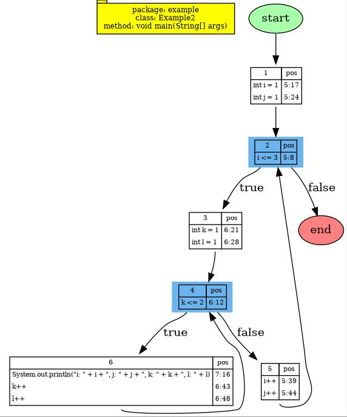

## Example 3: `for` loop with a simple `if`

```java
public class Example3 {
    public static void main(String[] args) {
        for (int i = 1; i <= 10; i++) {
            if (i % 2 == 0) {
                System.out.println(i + " is even");
            }
        }
    }
}
```

- [PDF](docs/Example3.main.pdf)

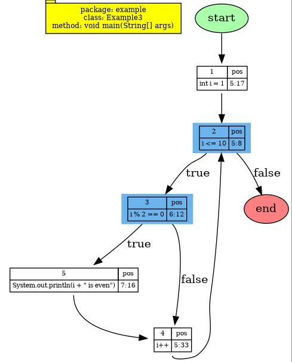

## Example 4: `if` / `else if` chain

```java
public class Example4 {
    public static void main(String[] args) {
        int number = 7;

        if (number > 0) {
            System.out.println("The number is positive");
        } else if (number < 0) {
            System.out.println("The number is negative");
        } else if (number % 2 == 0) {
            System.out.println("The number is zero");
            System.out.println("The number is also even");
        } else if (number % 2 != 0) {
            System.out.println("The number is zero");
            System.out.println("The number is also odd");
        } else {
            System.out.println("The number is zero");
            System.out.println("The number is also divisible by 2");
        }
    }
}
```

- [PDF](docs/Example4.main.pdf)

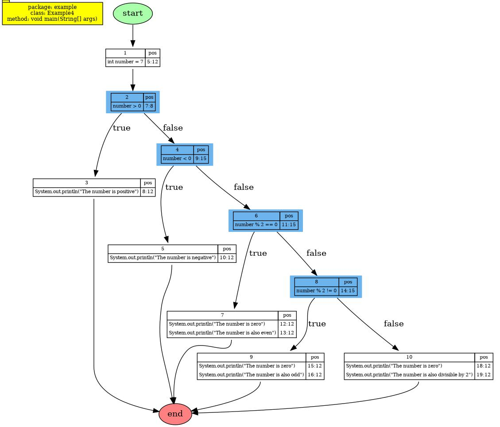

## Example 5: `while` loop

```java
public class Example5 {
    public static void main(String[] args) {
        int i = 1;
        while (i <= 5) {
            System.out.println(i);
            i++;
        }
    }
}
```

- [PDF](docs/Example5.main.pdf)

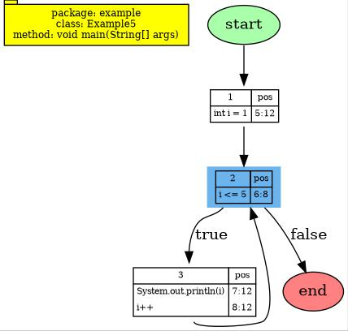

## Example 6: `do`-`while` loop

The condition sits *after* the body, and `true` runs the body again.

```java
public class Example6 {
    public static void main(String[] args) {
        int i = 1;
        do {
            System.out.println(i);
            i++;
        } while (i <= 5);
    }
}
```

- [PDF](docs/Example6.main.pdf)

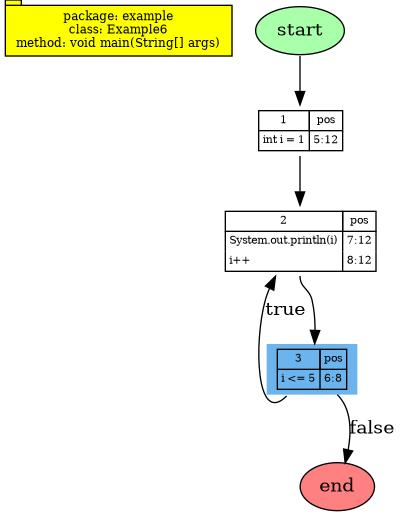

## Example 7: enhanced `for` over an array

The header tests `has next(numbers)` and the body opens with
`int number = next(numbers)`.

```java
public class Example7 {
    public static void main(String[] args) {
        int[] numbers = {1, 2, 3, 4, 5};
        for (int number : numbers) {
            System.out.println(number);
        }
    }
}
```

- [PDF](docs/Example7.main.pdf)

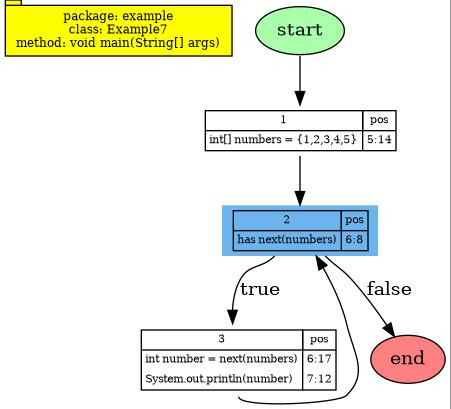

## Example 8: `switch` with a case per day

```java
public class Example8 {
    public static void main(String[] args) {
        int dayOfWeek = 3;

        switch (dayOfWeek) {
            case 1:  System.out.println("Monday");    break;
            case 2:  System.out.println("Tuesday");   break;
            case 3:  System.out.println("Wednesday"); break;
            case 4:  System.out.println("Thursday");  break;
            case 5:  System.out.println("Friday");    break;
            case 6:  System.out.println("Saturday");  break;
            case 7:  System.out.println("Sunday");    break;
            default: System.out.println("Invalid day of the week");
        }
    }
}
```

- [PDF](docs/Example8.main.pdf)

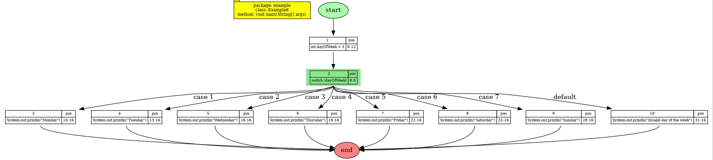

## Example 9: unreachable code after a `return`

Everything after the `return` is dropped from the graph and listed under
`unreachable` in the JSON, rather than being rewired into it.

```java
public class Example9 {
    public static void main(String[] args) {
        int totalIterations = 10;

        int whileCounter = 1;
        while (whileCounter <= totalIterations) {
            System.out.println(whileCounter);
            whileCounter++;
        }

        for (int i = 1; i <= totalIterations; i++) {
            System.out.println("test");
        }

        return;

        int doWhileCounter = 1;
        do {
            // ... never reached
        } while (doWhileCounter <= totalIterations);
    }
}
```

- [PDF](docs/Example9.main.pdf)

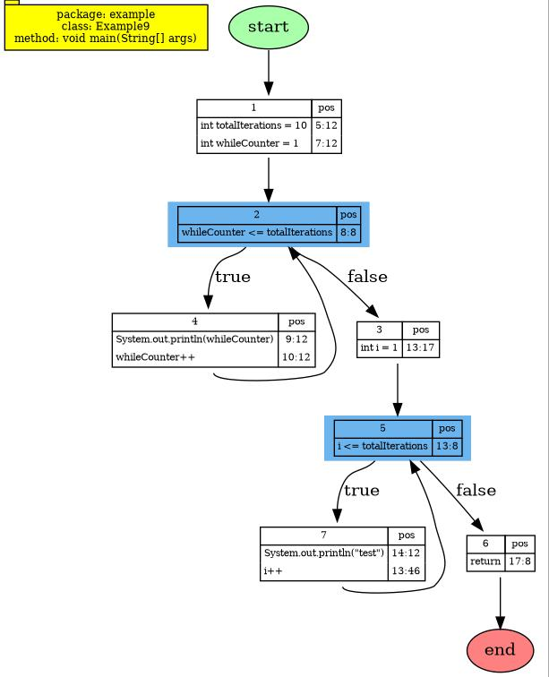

## Example 10: `while` + `for` + `do`-`while` with an `else if` chain

This is the one the old generator got wrong: the `% 5 == 0` branch and
`doWhileCounter++` were both missing from its graph.

```java
public class Example10 {
    public static void main(String[] args) {
        int totalIterations = 10;

        int whileCounter = 1;
        while (whileCounter <= totalIterations) {
            System.out.println(whileCounter);
            whileCounter++;
        }

        for (int i = 1; i <= totalIterations; i++) {
            System.out.println("test");
        }

        int doWhileCounter = 1;
        do {
            if (doWhileCounter % 3 == 0) {
                System.out.println("Divisible by 3: " + doWhileCounter);
            } else if (doWhileCounter % 5 == 0) {
                System.out.println("Divisible by 5: " + doWhileCounter);
            } else {
                System.out.println("Not divisible by 3 or 5: " + doWhileCounter);
            }
            doWhileCounter++;
        } while (doWhileCounter <= totalIterations);
    }
}
```

- [PDF](docs/Example10.main.pdf)

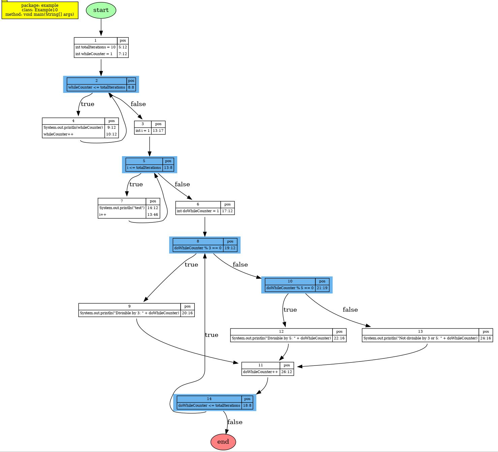

## Example 11: dangling `if` with an un-braced `else for`

The old generator lost the inner `i < 5` condition entirely, showing the
then-branch and the `for` loop as sequential rather than exclusive.

```java
public class Main {
    int i, j;
    double k = 5;

    public static void main(String[] args) {
        int j = 0, i = 0;
        int a = 5 - i;

        if (a < i * 3) if (i < 5) {
            int j;
            j = 3 * i + a;
            System.out.println(j * 4);
        } else for (int k = 1; k <= 5; k++) {
            System.out.println(k);
        }
    }
}
```

- [PDF](docs/Main.main.pdf)

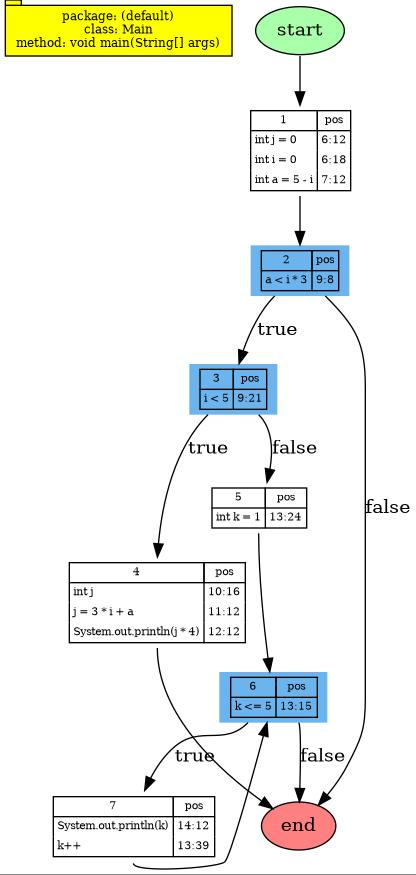

## Example 12: `break` and `continue` in every loop form

`continue` is the edge into the update block; `break` is the edge to the loop
exit. Both used to be statements inside a block, with no edges at all.

```java
public class Example12 {
    public static void main(String[] args) {
        for (int i = 0; i < 10; i++) {
            if (i % 2 == 0) { continue; }
            if (i > 7)      { break; }
            System.out.println(i);
        }

        int j = 0;
        while (j < 10) {
            j++;
            if (j == 3) { continue; }
            if (j == 8) { break; }
            System.out.println(j);
        }

        int k = 0;
        do {
            k++;
            if (k == 2) { continue; }
            if (k == 5) { break; }
            System.out.println(k);
        } while (k < 10);
    }
}
```

- [PDF](docs/Example12.main.pdf)

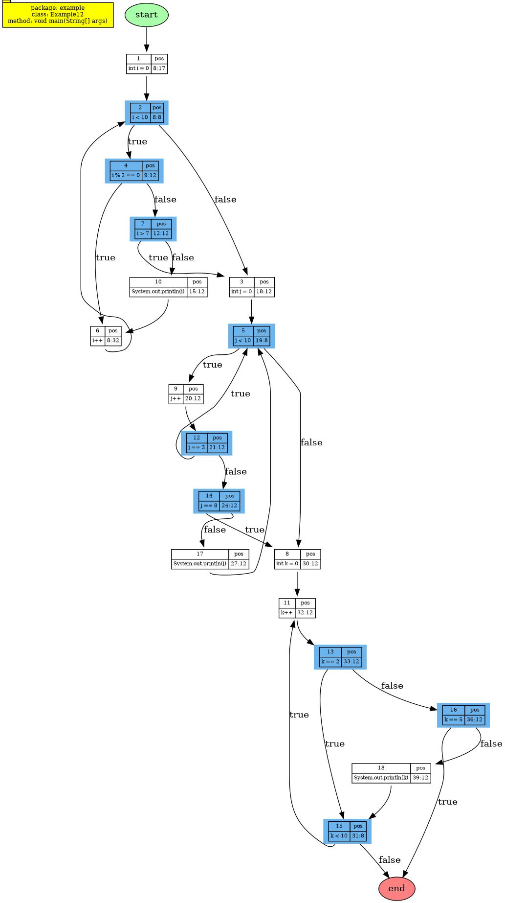

## Example 13: labelled `break` and `continue`

`continue outer` reaches the *outer* loop's update block; `break outer` leaves
both loops; `break block` exits a labelled block.

```java
public class Example13 {
    public static void main(String[] args) {
        outer:
        for (int i = 0; i < 5; i++) {
            for (int j = 0; j < 5; j++) {
                if (j == 3)      { continue outer; }
                if (i * j > 6)   { break outer; }
                System.out.println(i + "," + j);
            }
            System.out.println("end of i " + i);
        }

        search:
        while (true) {
            for (int n = 0; n < 3; n++) {
                if (n == 2) { break search; }
            }
        }

        block: {
            System.out.println("in labeled block");
            if (args.length == 0) { break block; }
            System.out.println("has args");
        }
    }
}
```

- [PDF](docs/Example13.main.pdf)

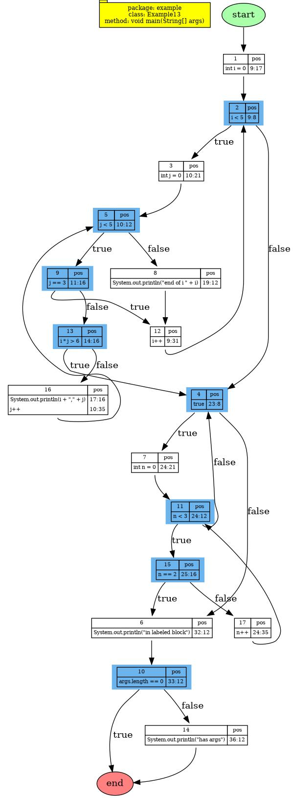

## Example 14: colon `switch` — fall-through, multi-label group, `default` in the middle

`case 1` falls through into the `case 2, 3` group; `case 0` does not, because it
ends in a `break`. Both labels of the group appear on the one edge.

```java
public static String classify(int value) {
    String name = "";
    switch (value) {
        case 0:
            name = "zero";
            break;
        case 1:
            name = "one";
            // falls through
        case 2:
        case 3:
            name = name + " small";
            break;
        default:
            name = "many";
            break;
        case 99:
            name = "sentinel";
    }
    return name;
}
```

- [PDF](docs/Example14.classify.pdf)

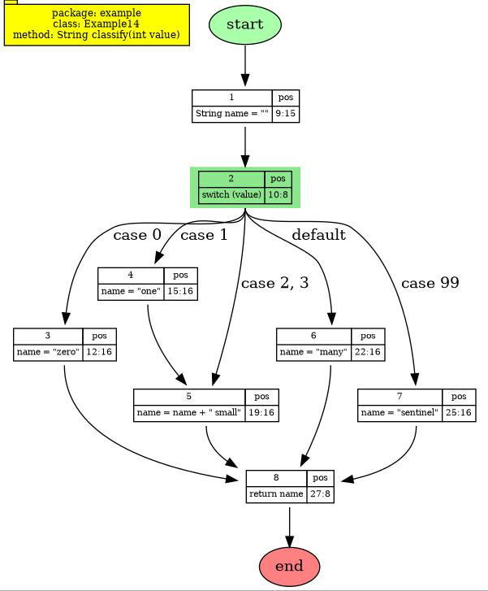

Also in this file: [`main`](docs/Example14.main.pdf)
([figure](docs/Example14.main.jpg)), the loop that drives it.

## Example 15: arrow `switch`

The `->` form never falls through, and the `throw` in `default` leaves the method.

```java
public class Example15 {
    public static void main(String[] args) {
        int day = args.length;

        switch (day) {
            case 1, 7 -> System.out.println("weekend");
            case 2, 3, 4, 5, 6 -> {
                System.out.println("weekday");
                System.out.println("work");
            }
            default -> throw new IllegalArgumentException("bad day");
        }

        System.out.println("done");
    }
}
```

- [PDF](docs/Example15.main.pdf)

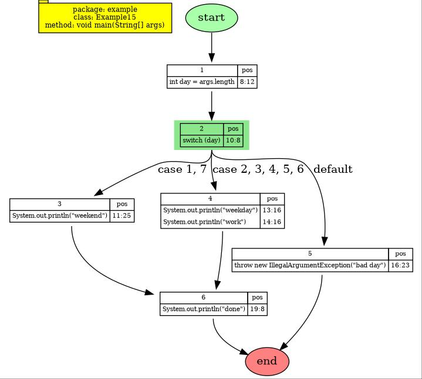

## Example 16: `try` / `catch` / multi-catch / `finally` / `throw`

Dashed edges are exception edges, from the protected region to each handler. The
`return` inside the second `catch` runs the `finally` first, which is why that
block has both a normal edge onward and a dotted `abrupt` edge to `end`.

```java
public static int read(String path) {
    int result = -1;
    try {
        if (path == null) {
            throw new IllegalArgumentException("null path");
        }
        result = path.length();
        System.out.println("read ok");
    } catch (IllegalArgumentException e) {
        System.out.println("bad argument");
        result = 0;
    } catch (RuntimeException | Error e) {
        System.out.println("fatal");
        return -2;
    } finally {
        System.out.println("cleanup");
    }
    return result;
}
```

- [PDF](docs/Example16.read.pdf)

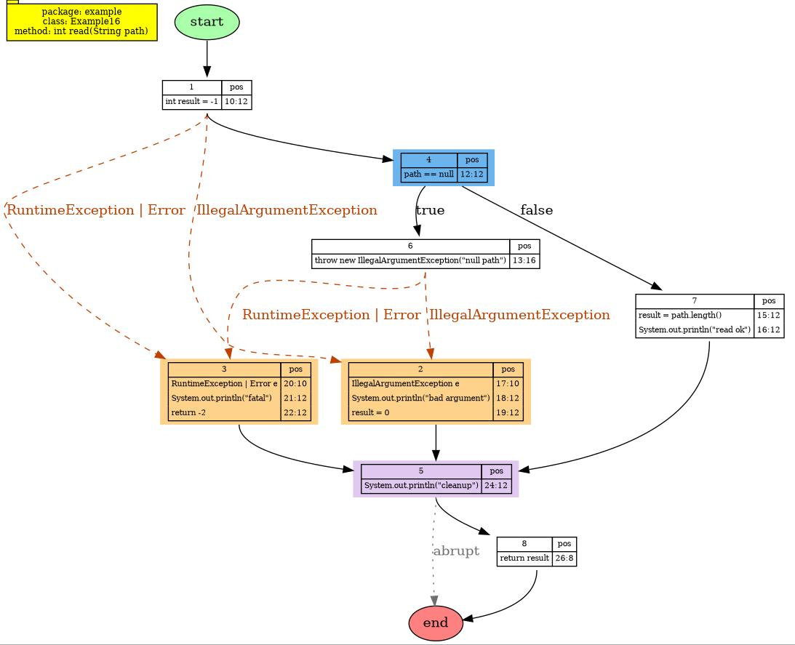

Also in this file: [`plainTry`](docs/Example16.plainTry.pdf)
([figure](docs/Example16.plainTry.jpg)) and
[`finallyOnly`](docs/Example16.finallyOnly.pdf)
([figure](docs/Example16.finallyOnly.jpg)).

## Example 17: un-braced bodies and a dangling `else`

The `else` binds to the *inner* `if`. This parses as the grammar's
`ifThenElseStatementNoShortIf`, which had no handler at all before.

```java
public static void danglingElse(int a, int b) {
    if (a > 0)
        if (b > 0)
            System.out.println("both positive");
        else
            System.out.println("a positive, b not");
    else
        System.out.println("a not positive");
}
```

- [PDF](docs/Example17.danglingElse.pdf)

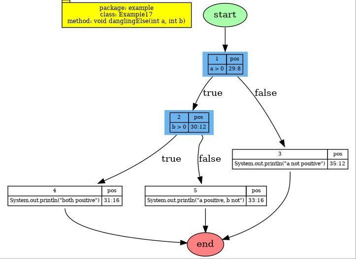

An un-braced `return` in the then-branch used to be filed into the else branch:

```java
public static int sign(int n) {
    if (n > 0) return 1;
    else if (n < 0) return -1;
    else return 0;
}
```

- [PDF](docs/Example17.sign.pdf)

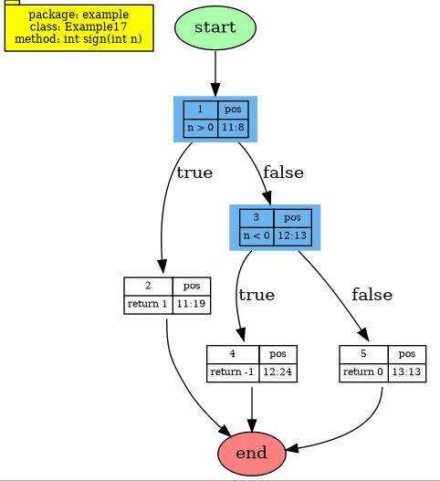

Also in this file: [`size`](docs/Example17.size.pdf)
([figure](docs/Example17.size.jpg)) and
[`unbracedLoops`](docs/Example17.unbracedLoops.pdf)
([figure](docs/Example17.unbracedLoops.jpg)).

## Example 18: expression shapes

`>>>` used to be built from two of its three tokens, leaving `>` as the operand.
Field access `a.b` used to become a binary expression rendered `a . b`.

```java
public int shifts(int v) {
    int a = v << 2;
    int b = v >> 1;
    int c = v >>> 3;
    return a + b + c;
}
```

- [PDF](docs/Example18.shifts.pdf)

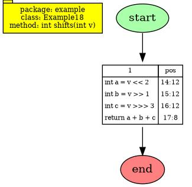

`instanceof` with a pattern binding, and short-circuit conditions kept whole:

```java
public String describe(Object o) {
    if (o instanceof String s) {
        return "string of length " + s.length();
    }
    if (o instanceof Integer) {
        return "boxed int";
    }
    return "unknown";
}
```

- [PDF](docs/Example18.describe.pdf)

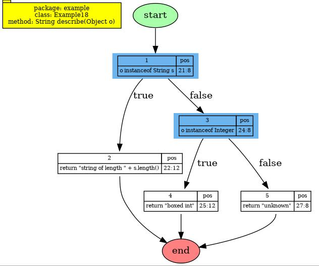

Also in this file:
[`ternaryAndShortCircuit`](docs/Example18.ternaryAndShortCircuit.pdf)
([figure](docs/Example18.ternaryAndShortCircuit.jpg)).

## Example 19: enhanced `for` over a collection

Modeled with an iterator, not an index rewrite — the old `.length` rewrite was
wrong for anything that is not an array, and there is no type resolution here to
tell them apart. `continue` returns to the header.

```java
public static void printNames(List<String> names) {
    for (String name : names) {
        if (name.isEmpty()) {
            continue;
        }
        System.out.println(name);
    }
}
```

- [PDF](docs/Example19.printNames.pdf)

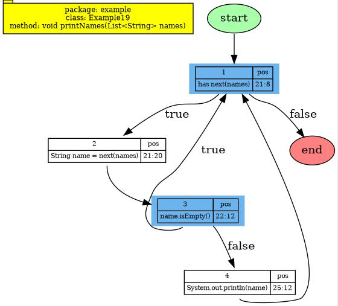

Nested for-each with an early `return`:

```java
public static int firstNegative(int[][] grid) {
    for (int[] row : grid) {
        for (int cell : row) {
            if (cell < 0) {
                return cell;
            }
        }
    }
    return 0;
}
```

- [PDF](docs/Example19.firstNegative.pdf)

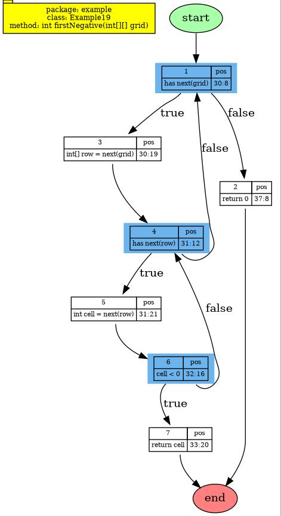

Also in this file: [`sumArray`](docs/Example19.sumArray.pdf)
([figure](docs/Example19.sumArray.jpg)).

## Example 20: early returns, `for (;;)`, infinite loop

```java
public static int find(int[] values, int target) {
    if (values == null) {
        return -1;
    }
    for (int i = 0; i < values.length; i++) {
        if (values[i] == target) {
            return i;
        }
    }
    return -1;
}
```

- [PDF](docs/Example20.find.pdf)

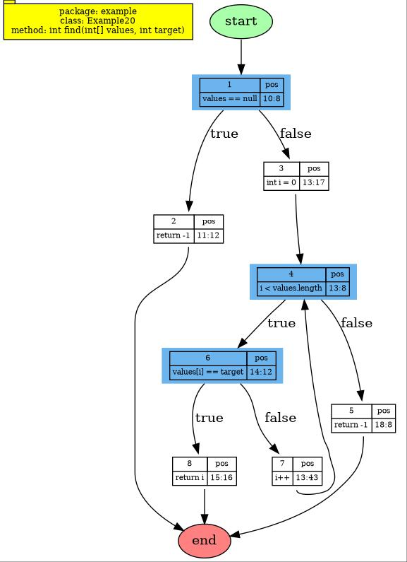

`for (;;)` gets an always-true header, so the loop shape stays uniform, and
`break` is the only way out:

```java
public static int countdown(int start) {
    int n = start;
    for (;;) {
        if (n <= 0) {
            break;
        }
        System.out.println(n);
        n--;
    }
    return n;
}
```

- [PDF](docs/Example20.countdown.pdf)

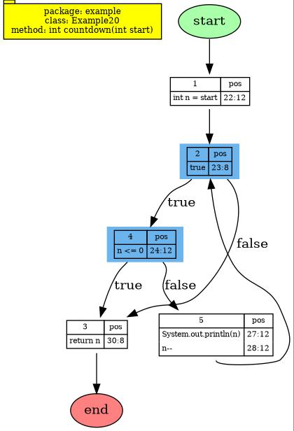

Also in this file: [`infiniteLoop`](docs/Example20.infiniteLoop.pdf)
([figure](docs/Example20.infiniteLoop.jpg)) — a `while (true)` body legitimately
has no path to `end`, which the invariant checker allows only for blocks
genuinely on a cycle — and
[`unreachableTail`](docs/Example20.unreachableTail.pdf)
([figure](docs/Example20.unreachableTail.jpg)).

## Example 21: nested classes, initializers, constructors, overloads

A single `CurrentClass` slot used to mean a nested class clobbered its enclosing
one. Now each method is scoped: `Example21.Helper.twice`,
`Example21.Inner.plusOuter`, `Example21.<clinit>`.

```java
public class Example21 {
    private int value;
    private static int instances;

    static { instances = 0; System.out.println("class loaded"); }

    { value = -1; }

    public Example21() { this(0); }

    public Example21(int value) {
        this.value = value;
        instances++;
        if (value < 0) { this.value = 0; }
    }

    public int scale(int factor) { return value * factor; }

    public int scale(int factor, int offset) {
        if (offset == 0) { return scale(factor); }
        return value * factor + offset;
    }

    static class Helper { int twice(int n) { return n + n; } }

    class Inner {
        int plusOuter(int n) {
            if (n < 0) { return value; }
            return value + n;
        }
    }
}
```

The two-argument overload — note that overloads each get their own figure, with a
suffix on the filename:

- [PDF](docs/Example21.scale__2args_1.pdf)

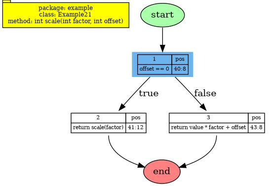

The inner class method:

- [PDF](docs/Example21.Inner.plusOuter.pdf)

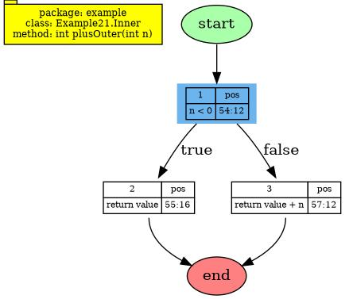

Also in this file: [`<clinit>`](docs/Example21._clinit_.pdf)
([figure](docs/Example21._clinit_.jpg)),
[`<init>`](docs/Example21._init_.pdf) ([figure](docs/Example21._init_.jpg)),
both constructors ([no-arg](docs/Example21.Example21.jpg),
[one-arg](docs/Example21.Example21__1args_1.jpg)),
[`scale`](docs/Example21.scale.jpg), and
[`Helper.twice`](docs/Example21.Helper.twice.jpg).

## Example 22: interface with `default` and `static` methods

`interfaceMethodDeclaration` is a separate grammar rule, so these bodies were
never visited before. The abstract `apply` has no body and correctly produces no
CFG.

```java
public interface Example22 {

    int apply(int value);

    default int applyTwice(int value) {
        int once = apply(value);
        if (once == value) {
            return once;
        }
        return apply(once);
    }

    static int clamp(int value, int max) {
        if (value < 0)   { return 0; }
        if (value > max) { return max; }
        return value;
    }
}
```

- [PDF](docs/Example22.applyTwice.pdf)

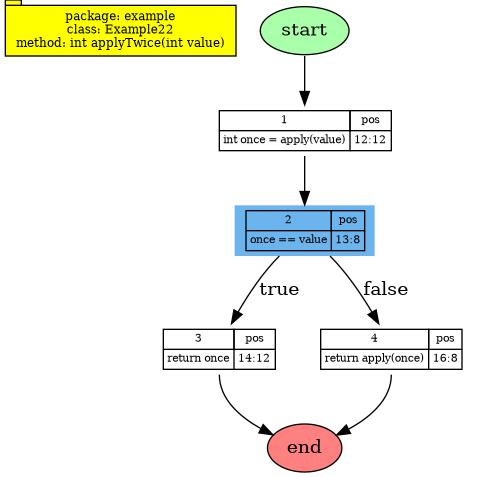

Also in this file: [`clamp`](docs/Example22.clamp.pdf)
([figure](docs/Example22.clamp.jpg)).

## Example 23: lambdas, method references, anonymous class

A lambda body used to be spliced into the enclosing method's CFG. Each now gets
its own graph, and the enclosing block shows only the elided lambda.

```java
public static void main(String[] args) {
    List<String> names = List.of("ada", "grace", "alan");

    names.forEach(name -> {
        if (name.startsWith("a")) {
            System.out.println("a-name: " + name);
        } else {
            System.out.println("other: " + name);
        }
    });

    Function<Integer, Integer> square = n -> n * n;
    System.out.println(square.apply(5));

    names.forEach(System.out::println);

    Runnable task = new Runnable() {
        @Override
        public void run() {
            for (int i = 0; i < 3; i++) {
                System.out.println("tick " + i);
            }
        }
    };
    task.run();
}
```

The enclosing method — one straight-line block, with each lambda shown as
`name -> {...}`:

- [PDF](docs/Example23.main.pdf)

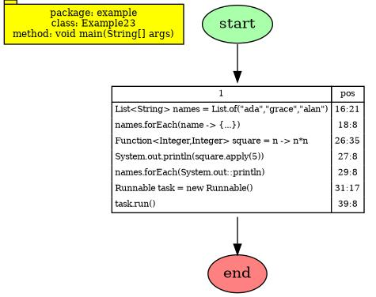

The first lambda's own graph:

- [PDF](docs/Example23.main$lambda$0.pdf)

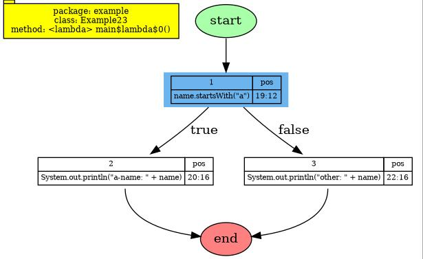

The anonymous class's `run` method:

- [PDF](<docs/Example23.Runnable$anon1.run.pdf>)


Also in this file: [`main$lambda$1`](docs/Example23.main$lambda$1.jpg), the
expression-bodied `n -> n * n`.

## Example 24: try-with-resources, `assert`, `synchronized`

```java
public int countLines(String path) throws IOException {
    int lines = 0;
    try (BufferedReader reader = new BufferedReader(new FileReader(path))) {
        while (reader.readLine() != null) {
            lines++;
        }
    } catch (IOException e) {
        return -1;
    }
    return lines;
}
```

- [PDF](docs/Example24.countLines.pdf)

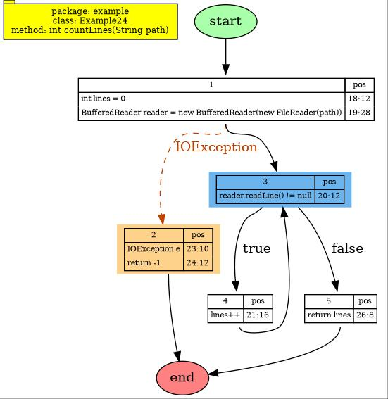

`assert` is a branch, because it is one — the failing path raises AssertionError
and leaves the method:

```java
public int average(int[] values) {
    assert values != null : "values must not be null";
    assert values.length > 0;

    int sum = 0;
    for (int v : values) {
        sum += v;
    }
    return sum / values.length;
}
```

- [PDF](docs/Example24.average.pdf)

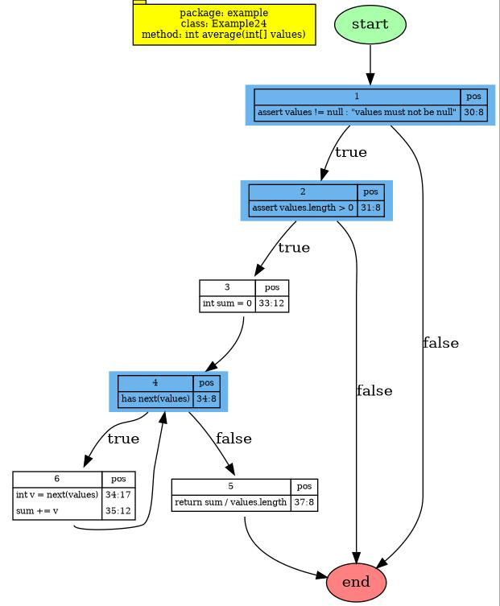

`synchronized` is inlined between explicit monitor statements, since taking a
lock does not branch:

- [PDF](docs/Example24.add.pdf)

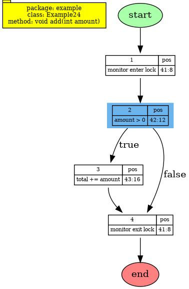

## Example 25: degenerate shapes

Each of these caught a real bug once the invariant checker was pointed at it.

`if (c) {} else {}` leaves two empty arms whose `true` and `false` edges reach
the same join. Contracting both would have overwritten one label and silently
lost a branch, because a DiGraph holds one edge per node pair — so one arm is
kept on purpose:

```java
void emptyIf(int n) {
    if (n > 0) {} else {}
}
```

- [PDF](docs/Example25.emptyIf.pdf)

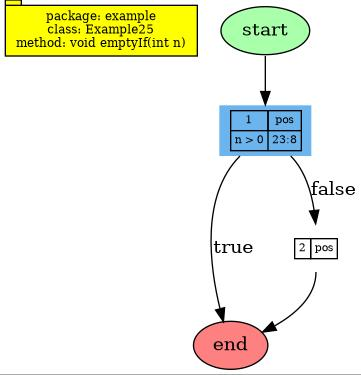

Nested `try`/`finally` must keep the normal and abrupt paths out of each
`finally` distinct:

```java
void nestedTryFinally() {
    try {
        try {
            System.out.println("inner");
        } catch (RuntimeException e) {
            throw e;
        } finally {
            System.out.println("inner finally");
        }
    } catch (Exception e) {
        System.out.println("outer");
    } finally {
        System.out.println("outer finally");
    }
}
```

- [PDF](docs/Example25.nestedTryFinally.pdf)

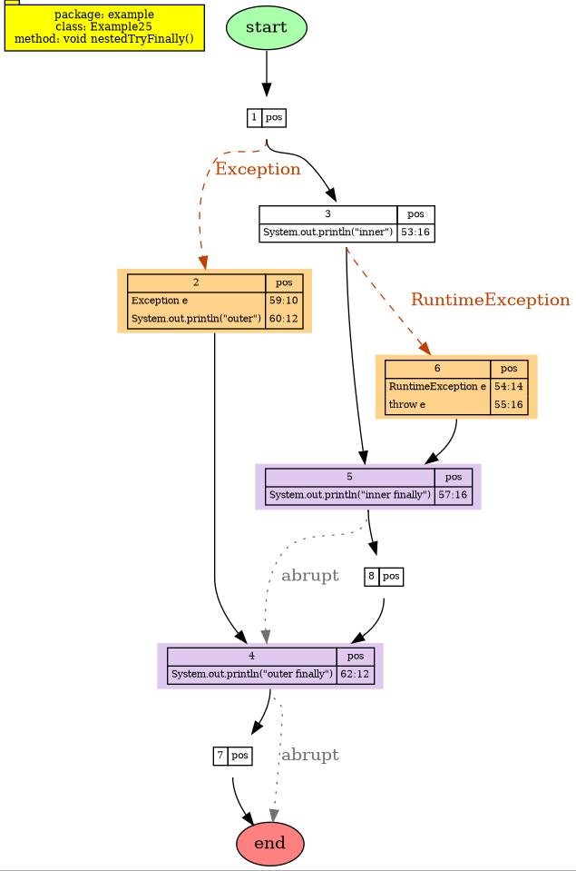

Deeply nested un-braced loops, where `else break` exits the innermost loop and
`else continue` re-enters it:

```java
void deeplyNestedUnbraced(int n) {
    for (int i = 0; i < n; i++)
        for (int j = 0; j < n; j++)
            for (int k = 0; k < n; k++)
                if (i == j)
                    if (j == k) System.out.println(i);
                    else continue;
                else break;
}
```

- [PDF](docs/Example25.deeplyNestedUnbraced.pdf)

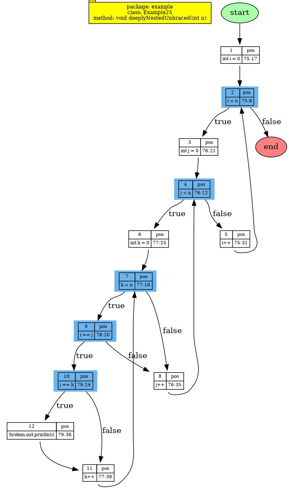

Also in this file, each with a figure in `docs/`:
[`emptyBody`](docs/Example25.emptyBody.jpg),
[`onlySemicolons`](docs/Example25.onlySemicolons.jpg),
[`emptyBlocks`](docs/Example25.emptyBlocks.jpg),
[`emptyLoops`](docs/Example25.emptyLoops.jpg),
[`emptySwitch`](docs/Example25.emptySwitch.jpg),
[`switchWithOnlyDefault`](docs/Example25.switchWithOnlyDefault.jpg),
[`switchWithoutDefault`](docs/Example25.switchWithoutDefault.jpg),
[`returnInsideFinally`](docs/Example25.returnInsideFinally.jpg),
[`throwOnly`](docs/Example25.throwOnly.jpg).

---

## Limitations and non-goals

- **No type resolution.** Names and types are text. This is why `for`-each is
  modeled with an iterator rather than an index.
- **No interprocedural edges.** A call is a statement, not an edge. Each method
  gets its own graph.
- **`&&`, `||`, and `?:` are not expanded into branches.** They stay single
  conditions, which is what makes this a *source-level* CFG. Expanding them would
  double the block count of most real conditions.
- **`switch` *expressions* are not expanded.** They carry control flow inside an
  expression; the expression is rendered as text and a warning is emitted
  (`--strict` turns it into an error).
- **`finally` is not duplicated per exit path.** See the `abrupt` edge above.
- Exception edges are block-level, not per-statement, and no attempt is made to
  work out which `catch` a given `throw` actually matches.
- Annotations and generics are carried as text; they have no effect on flow.

## Regenerating the parser

`gen/` is checked in, so ANTLR is only needed if you change the grammar.

```shell
# needs a JRE and antlr-4.13.1-complete.jar
java -jar antlr-4.13.1-complete.jar -Dlanguage=Python3 -visitor -listener \
     -o gen grammars/Java20Lexer.g4 grammars/Java20Parser.g4
```

The `-visitor` flag matters: `slcfg/astbuilder.py` extends the generated visitor.

## A note on scope

This is a learning project, not a production analysis tool. If you are building
something real — a compiler, an obfuscator, an instrumentation pass — use a
compiler infrastructure instead of reinventing it: [LLVM](https://llvm.org/), or
for Java, [ASM](https://asm.ow2.io/javadoc/index.html). ANTLR is excellent at
syntax checking, at learning how compilers work, and at extracting names and
structure from code, which is what it is doing here.
