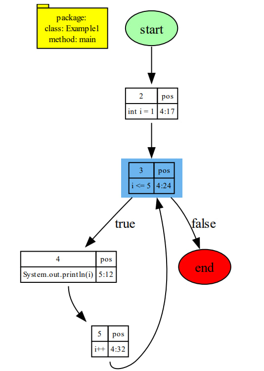
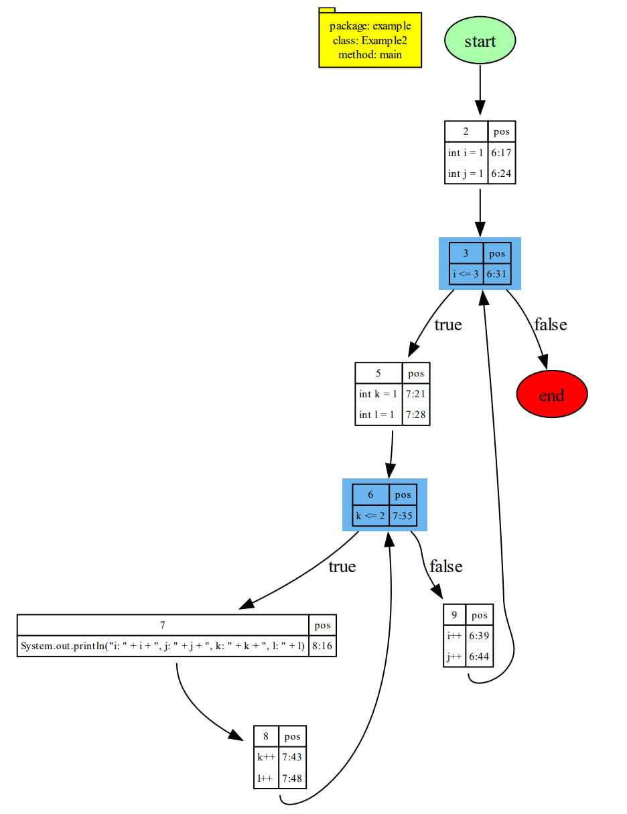
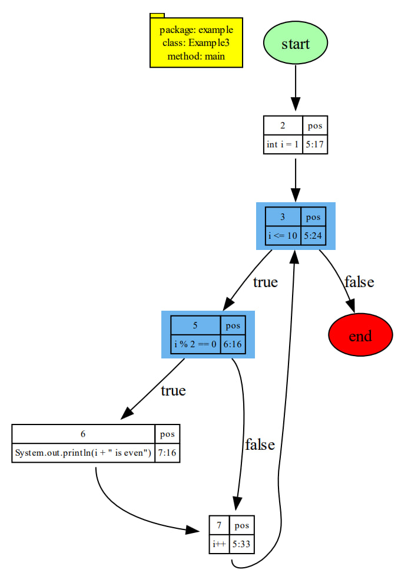
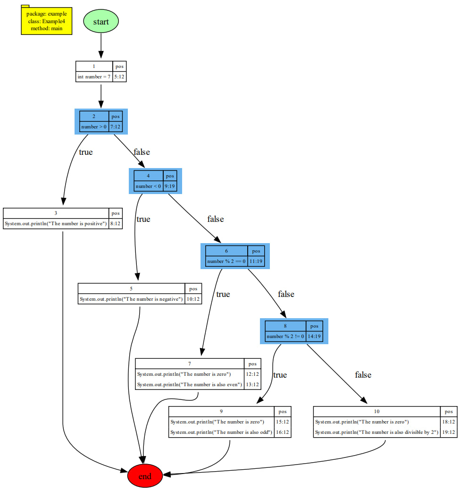
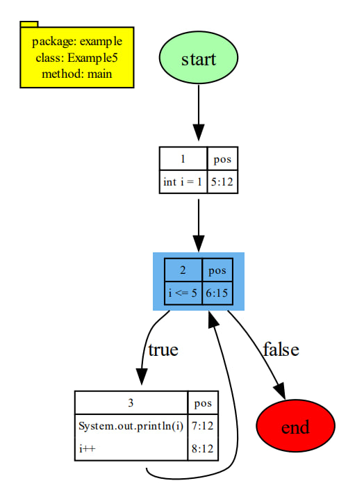
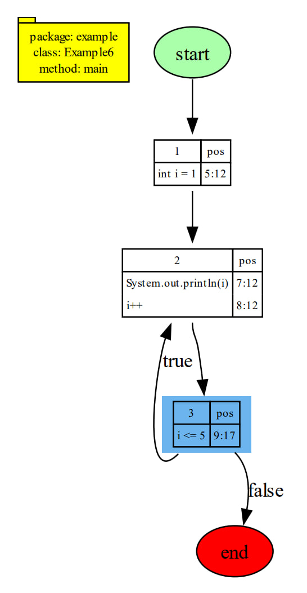
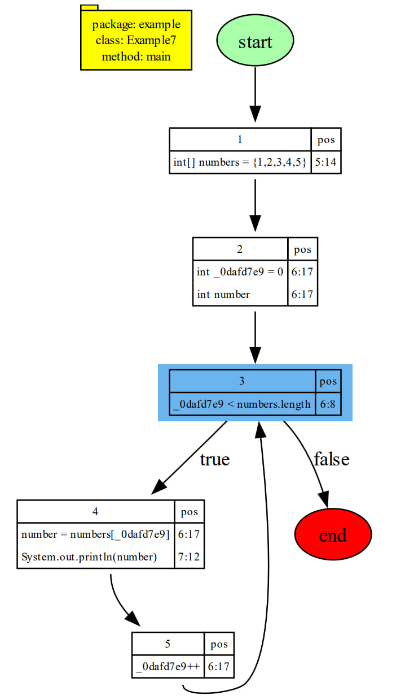
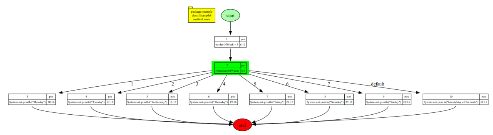
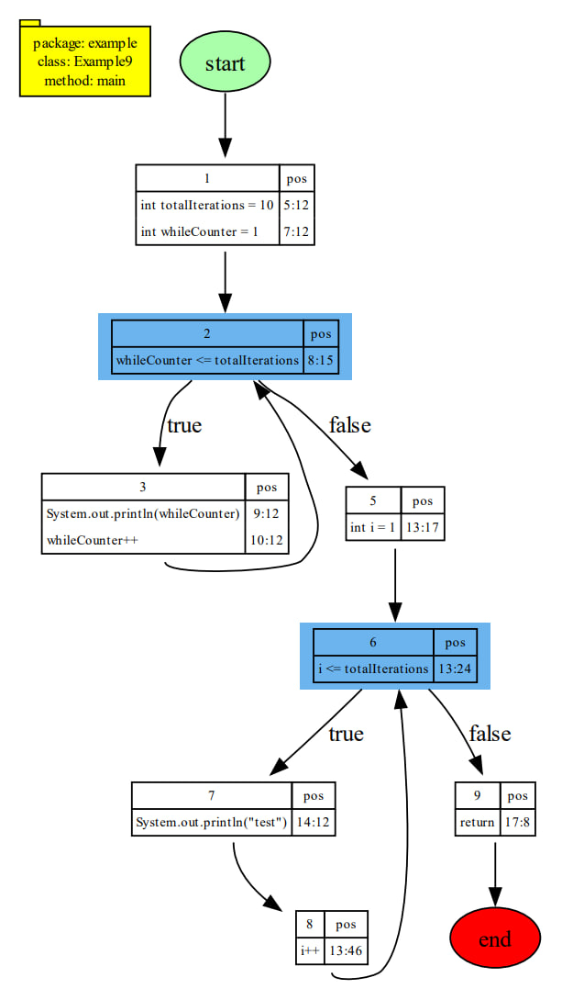
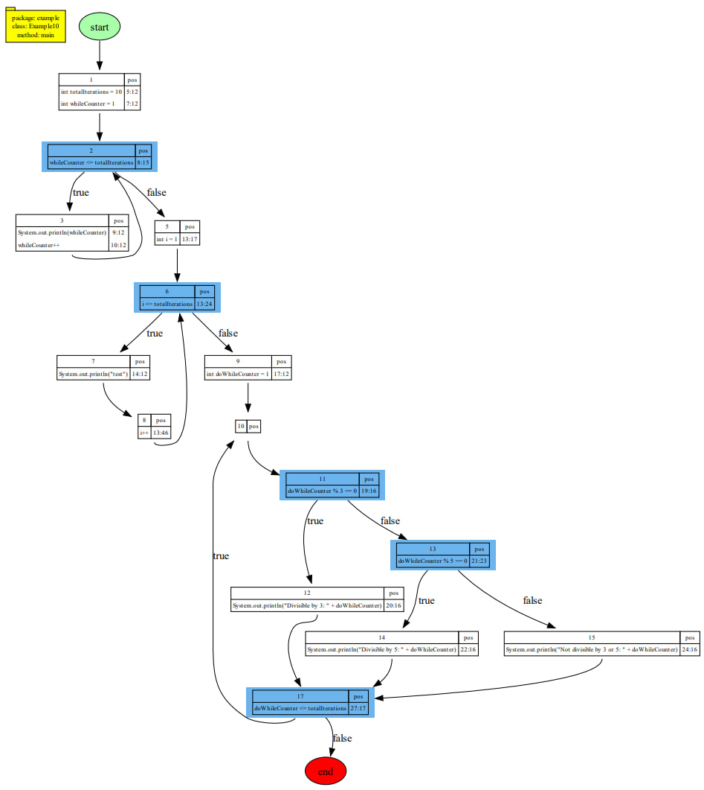

# Source-Level Java CFG Generator

## Overview

I was reading about the Golang compiler, and I searched on YouTube, where I found these videos:

- [GopherCon 2022: Jesús Espino - Hello World, from the Code to the Screen](https://www.youtube.com/watch?v=rfbMj7F1vUQ)
- [GopherCon 2017: Keith Randall - Generating Better Machine Code with SSA](https://youtu.be/uTMvKVma5ms?si=gi7I0bB_QhGw1sZV)

Afterward, I read the [ast](https://pkg.go.dev/go/ast) package documentation, gaining an understanding of the project. Subsequently, I utilized [this site](https://yuroyoro.github.io/goast-viewer/index.html) to mimic the Golang compiler and implemented my project.

Initially, I attempted to develop the project in Golang. However, upon starting to code with [this repo](https://github.com/uint48/antlr-golang), I discovered that using Python with ANTLR is considered more straightforward.

For the implementation, I used a WalkerState with a StmtStack to help the tree walker to walk the syntax tree and extract a Go-like AST. The code might not be clean, but I have made an effort to add comments, excluding the `cfg.py` file, where I used a trial and error method.

> [!CAUTION]
> This project is not completed, it's just a Proof Of Concept of my Idea.

## Use cases

- Gain an understanding of code structures at the assembly level.
- Challenge yourself to manually generate assembly or bytecode using the output Control Flow Graph (CFG).
- Dive into the concepts of parsers, lexers, syntax trees, and Abstract Syntax Trees (AST).  
- Learn how to utilize the ANTLR parser generator.
- Enhance your automata knowledge by engaging with Java grammar, Regular Grammars, and Context-Free Grammars.


## Final Result

As I have been working with ANTLR for 3 months, I understand that It's power lies in tasks such as syntax checking, learning how compilers work, 
or extracting names and features from code. If you want to build professional tools, 
like your homemade compiler, obfuscator, or cryptor,..., you don't need to reinvent the wheel. Instead, 
you just need to leverage compiler infrastructures like LLVM ([https://llvm.org/](https://llvm.org/)) or, in the case of Java, use [ASM](https://asm.ow2.io/javadoc/index.html).

Alternatively, you could piggyback on a recognized compiler like the [movfuscator project](https://github.com/xoreaxeaxeax/movfuscator).

## Usage


### Prerequisites

0. Python3.12
1. Install [Graphviz](https://graphviz.org/download/)
2. `pip install -r requirements.txt`

### Run

```shell
python main.py ./javasamples/Example1.java
```

## Examples

### Example 1: Basic `for` loop.

```java
public class Example1 {
    public static void main(String[] args) {
        for (int i = 1; i <= 5; i++) {
            System.out.println(i);
        }
    }
}
```
### Output 

- [PDF](docs/Example1.pdf)




### Example 2: Nested `for` loops with multiple initialized values.

```java
public class Example2 {
    public static void main(String[] args) {
        for (int i = 1, j = 1; i <= 3; i++, j++) {
            for (int k = 1, l = 1; k <= 2; k++, l++) {
                System.out.println("i: " + i + ", j: " + j + ", k: " + k + ", l: " + l);
            }
        }
    }
}
```

### Output 

- [PDF](docs/Example2.pdf)



### Example 3: `for` loop with a simple `if` statement.

```java
public class Example3 {
    public static void main(String[] args) {
        for (int i = 1; i <= 10; i++) {
            if (i % 2 == 0) {
                System.out.println(i + " is even");
            }
        }
    }
}
```

### Output 

- [PDF](docs/Example3.pdf)



### Example 4: `if-elif-else` statement.

```java
public class Example4 {
    public static void main(String[] args) {
        int number = 7;

        if (number > 0) {
            System.out.println("The number is positive");
        } else if (number < 0) {
            System.out.println("The number is negative");
        } else if (number % 2 == 0) {
            System.out.println("The number is zero");
            System.out.println("The number is also even");
        } else if (number % 2 != 0) {
            System.out.println("The number is zero");
            System.out.println("The number is also odd");
        } else {
            System.out.println("The number is zero");
            System.out.println("The number is also divisible by 2");
        }
    }
}

```

### Output 

- [PDF](docs/Example4.pdf)



### Example 5: `while` statement.

```java
public class Example5 {
    public static void main(String[] args) {
        int i = 1;
        while (i <= 5) {
            System.out.println(i);
            i++;
        }
    }
}
```

### Output 

- [PDF](docs/Example5.pdf)



### Example 6: `do-while` statement.

```java
public class Example6 {
    public static void main(String[] args) {
        int i = 1;
        do {
            System.out.println(i);
            i++;
        } while (i <= 5);
    }
}
```

### Output 

- [PDF](docs/Example6.pdf)



### Example 7: Enhanced `for` statement.

```java
public class Example7 {
    public static void main(String[] args) {
        int[] numbers = {1, 2, 3, 4, 5};
        for (int number : numbers) {
            System.out.println(number);
        }
    }
}
```

### Output 

- [PDF](docs/Example7.pdf)




### Example 8: `switch` statement.

```java
public class Example8 {
    public static void main(String[] args) {
        int dayOfWeek = 3;

        switch (dayOfWeek) {
            case 1:
                System.out.println("Monday");
                break;
            case 2:
                System.out.println("Tuesday");
                break;
            case 3:
                System.out.println("Wednesday");
                break;
            case 4:
                System.out.println("Thursday");
                break;
            case 5:
                System.out.println("Friday");
                break;
            case 6:
                System.out.println("Saturday");
                break;
            case 7:
                System.out.println("Sunday");
                break;
            default:
                System.out.println("Invalid day of the week");
        }
    }
}
```

### Output 

- [PDF](docs/Example8.pdf)



### Example 9: `return` statement

```java
public class Example9 {
    public static void main(String[] args) {
        int totalIterations = 10;

        int whileCounter = 1;
        while (whileCounter <= totalIterations) {
            System.out.println(whileCounter);
            whileCounter++;
        }

        for (int i = 1; i <= totalIterations; i++) {
            System.out.println("test");
        }
        
        return;

        int doWhileCounter = 1;
        do {
            if (doWhileCounter % 3 == 0) {
                System.out.println("Divisible by 3: " + doWhileCounter);
            } else if (doWhileCounter % 5 == 0) {
                System.out.println("Divisible by 5: " + doWhileCounter);
            } else {
                System.out.println("Not divisible by 3 or 5: " + doWhileCounter);
            }
            doWhileCounter++;
        } while (doWhileCounter <= totalIterations);
    }
}
```

### Output 

- [PDF](docs/Example9.pdf)



### Example 10:

```java
public class Example10 {
    public static void main(String[] args) {
        int totalIterations = 10;

        int whileCounter = 1;
        while (whileCounter <= totalIterations) {
            System.out.println("While loop iteration: " + whileCounter);
            whileCounter++;
        }

        for (int i = 1; i <= totalIterations; i++) {
            System.out.println("test");
        }

        int doWhileCounter = 1;
        do {
            if (doWhileCounter % 3 == 0) {
                System.out.println("Divisible by 3: " + doWhileCounter);
            } else if (doWhileCounter % 5 == 0) {
                System.out.println("Divisible by 5: " + doWhileCounter);
            } else {
                System.out.println("Not divisible by 3 or 5: " + doWhileCounter);
            }
            doWhileCounter++;
        } while (doWhileCounter <= totalIterations);
    }
}
```

### Output 

- [PDF](docs/Example10.pdf)



# TODO

1. Implement labeled statements.

2. Implement `continue` statements within a loop using labeled statements.

3. Implement `break` statements within a loop using labeled statements.

4. Implement `try`-`catch` (refer to: [educative.io](https://www.educative.io/answers/what-is-asttrybody-handlers-orelse-finalbody-in-python)).

5. Implement modern `switch` case.

6. Implement `switch` expressions.

7. Implement lambda expressions ([W3Schools - Java Lambda](https://www.w3schools.com/java/java_lambda.asp)).

8. Generics ? ([Baeldung - Java Generics](https://www.baeldung.com/java-generics)).

9. Recursion ? ([W3Schools - Java Recursion](https://www.w3schools.com/java/java_recursion.asp)).

10. https://www.w3schools.com/java/java_modifiers.asp

11. https://www.w3schools.com/java/java_packages.asp

12. https://www.w3schools.com/java/java_inheritance.asp

13. https://www.w3schools.com/java/java_polymorphism.asp

14. https://www.w3schools.com/java/java_inner_classes.asp

15. https://www.w3schools.com/java/java_abstract.asp

16. https://www.w3schools.com/java/java_interface.asp

17. https://www.w3schools.com/java/java_enums.asp

18. https://www.baeldung.com/java-stream-filter-lambda